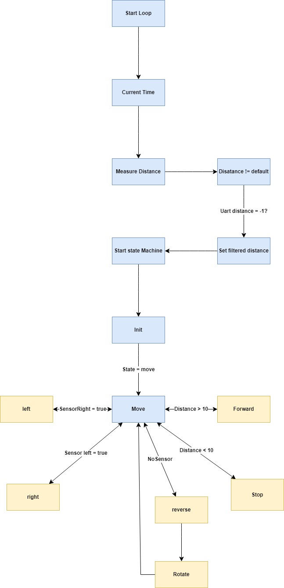

# Autonomous Platooning Robot

In this project, my team upgraded an earlier obstacle-avoidance robot so it could follow a track and maintain a safe distance from an object or robot moving in front of it.

The STM32 controller handles the sensors and motor behavior, while an ESP32 sends telemetry through MQTT to a Node-RED dashboard. The robot uses infrared sensors to follow the track and an ultrasonic sensor to measure the distance ahead. Based on those inputs, it can move forward, adjust its speed, turn, stop, reverse, or recover after losing the track.



## How the System Works

```text
Infrared sensors ─┐
Ultrasonic sensor ├── STM32 ── wheel servos
                  │     │
                  │    UART
                  │     ▼
                  └── ESP32 ─ MQTT ─ Node-RED
```

The STM32 remains responsible for the robot's movement. The ESP32 acts as the communication layer between the robot and the dashboard.

## My Contribution

I worked mainly on the low-level STM32 modules and the ESP32 communication layer.

My contribution included:

- configuring STM32 GPIO for the sensors and outputs;
- configuring timers used by the robot control system;
- implementing UART communication between the STM32 and ESP32;
- working on the servo and wheel-control functions;
- developing the ESP32 MQTT interfaces and `MyRobotMQTT` implementation;
- integrating the MQTT publisher, subscriber, and application code;
- helping connect these modules to the robot's movement state machine.

This project helped me understand how to separate real-time motor control from network communication while keeping both controllers synchronized.

## Main Technologies

- Embedded C and C++
- STM32F303RE Nucleo
- ESP32
- STM32CubeIDE
- PlatformIO
- UART
- MQTT and Node-RED
- Ultrasonic and infrared sensors
- Continuous-rotation servo motors

## Repository Structure

```text
PlatooningRobot_2024/
├── platooning_robot/          # STM32 robot controller
├── esp_swarm_communicator/    # ESP32 UART and MQTT gateway
├── node-red/                  # Dashboard flow
├── Documents/                 # Design files and flowchart
└── Main/                      # Additional STM32 project snapshot
```

## Running the Projects

Open `platooning_robot/` in STM32CubeIDE to build and flash the STM32 firmware.

Build the ESP32 communication project with:

```bash
pio run -d esp_swarm_communicator
```

The Node-RED dashboard can be restored by importing the JSON flow from the `node-red` folder and configuring the MQTT broker used by the ESP32.

The control values, motor direction, sensor thresholds, Wi-Fi settings, and MQTT settings were created for the original prototype and may need to be adjusted for another setup.
