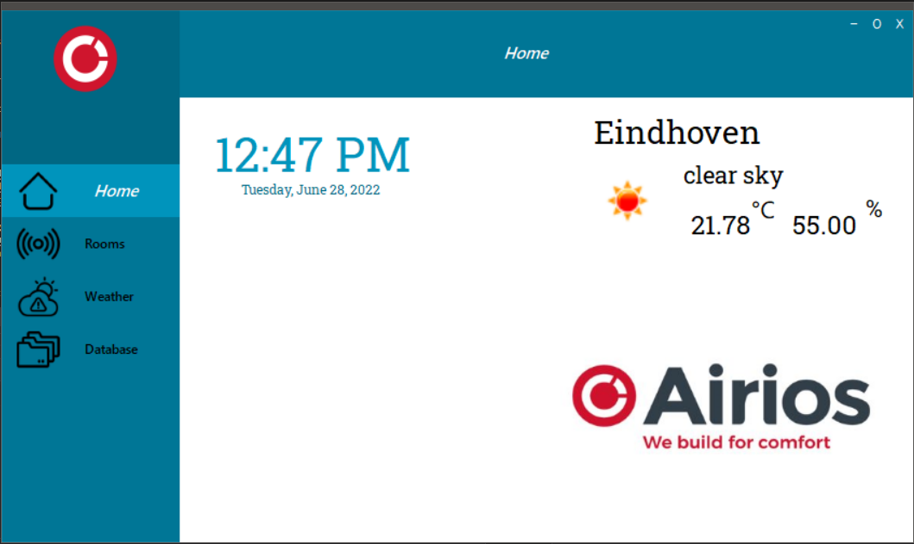

# Room Climate Control System

In this project, my team built a prototype that monitors indoor climate conditions and helps keep the room comfortable through automatic or manual ventilation control.

The system reads temperature, humidity, CO2, and air-quality values. An Arduino processes the sensors and controls a fan, while a Nextion touchscreen lets the user view information and change settings locally. An ESP communication layer connects the embedded system to a C# desktop application, which can display stored room data and external weather information.



## How the System Works

```text
Climate sensors ─ Arduino ─ fan and Nextion display
                      │
                 serial / ESP
                      │
                      ▼
              C# desktop application
                 │              │
              MongoDB      OpenWeather
```

The repository contains several experiments and versions that were created while developing and testing the final prototype.

## My Contribution

I worked on several parts of both the embedded system and the user interface.

My contribution included:

- testing the CO2 sensor;
- developing a Nextion fan-speed-control prototype;
- designing the Nextion touchscreen interface;
- working on the integrated `project_ui_system` firmware;
- working with one of my teammate on ESP communication;
- contributing to unit testing and Wi-Fi communication testing;
- creating the original desktop-application proof of concept;
- rebuilding the final version of the desktop application together with one of my teammate;
- contributing to the project plan and system design documentation.

This project gave me experience across the complete path from sensor acquisition and embedded control to communication, data storage, and a user-facing desktop application.

## Main Technologies

- C++ and Arduino framework
- Arduino Uno and ESP communication board
- PlatformIO
- Nextion touchscreen and Nextion Editor
- BME280, CCS811, and CO2 sensor experiments
- C# Windows Forms and .NET Framework
- TCP communication
- MongoDB
- OpenWeather API

## Repository Structure

```text
RoomClimateControl/
├── src/
│   ├── project_ui_system/          # Integrated Arduino firmware
│   ├── project_ui_design/          # Nextion UI design
│   ├── ESP32system/                # ESP communication project
│   ├── nextion_fan_speed_control/  # Fan-control prototype
│   ├── CO2_Testing/                # CO2 sensor experiment
│   ├── wifi_testing/               # Communication testing
│   └── system_unit_test/           # Unit-test experiment
├── bin/                             # C# desktop application
└── docs/                            # Plans, designs, reports, and images
```

## Running the Main Components

Build the integrated Arduino firmware with:

```bash
pio run -d src/project_ui_system
```

Open the Nextion design in Nextion Editor:

```text
src/project_ui_design/nextion_touchscreen_design.HMI
```

Open the C# solution in Visual Studio:

```text
bin/V 3.5 indoor_climate_control_app/project_climate_control_app.sln
```

The cloud credentials and API configuration in this historical project should be removed from source code and replaced with ignored local configuration before the repository is published.
