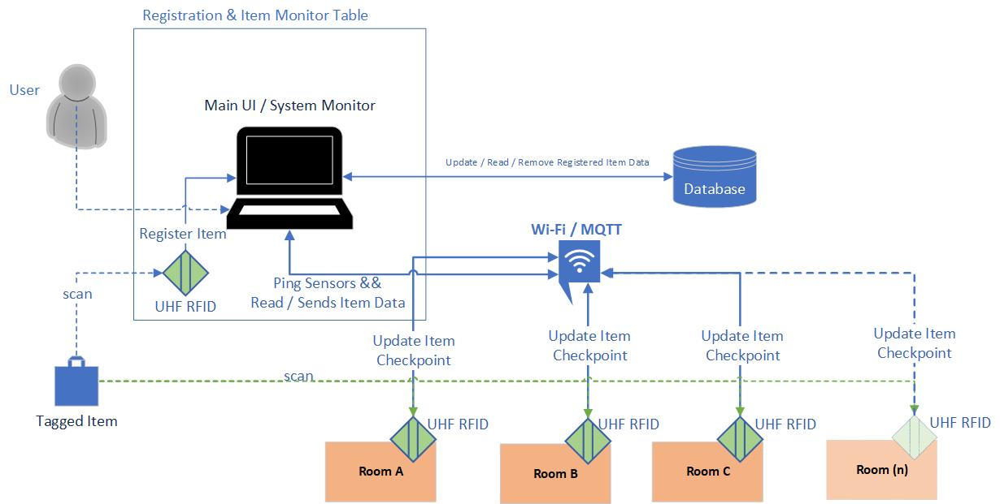

# Hospital Fixed-Asset Tracking System

This project is an industry-based embedded product research internship that I have done with the Imperial Healthtech company in Indonesia while I was taking my gap semester from Fontys ICT.

I built this project to track movable hospital equipment with UHF RFID tags and fixed room checkpoints. Instead of trying to calculate a continuous indoor position, the system records the most recent checkpoint that detected an asset and uses that information to show its current or last known room.

The project combines embedded firmware, MQTT communication, a backend API, persistent storage, and two browser applications into one complete workflow.

> This is an asset-tracking prototype. It does not track patients, make clinical decisions, or replace normal hospital procedures.



## What I built

I worked across the complete project lifecycle, including requirements, use cases, architecture, database design, firmware, backend services, frontend applications, testing, deployment preparation, and technical documentation.

The system consists of four main software products:

- **Sensor Node Firmware** — runs on ESP32 devices connected to a UHF RFID reader. The same firmware can be configured as a Registration Desk Node or a Checkpoint Node.
- **Backend System** — validates API and MQTT input, applies business rules, stores data, generates alerts and activity records, and broadcasts live updates.
- **Registration App** — supports first-admin setup, authentication, node management, asset registration and deregistration, movement decisions, user management, password changes, and system settings.
- **Monitor App** — shows asset locations, node availability, alerts, activity, and movement states, and allows authorized users to request or cancel a movement.

## Main workflow

1. A user scans an RFID tag at a Registration Desk Node and registers the asset with an assigned room.
2. The asset remains in a pending-placement state until a Checkpoint Node detects it in that room.
3. Later movement is requested from the Monitor App and approved or rejected from the Registration App.
4. An approved movement is completed only when the destination checkpoint detects the asset.
5. A detection in an unexpected room can create a wrong-location or unauthorized-movement warning.
6. Heartbeats keep node status current. Missing heartbeats cause the backend to mark a node offline.
7. WebSocket events update both web applications without requiring a normal page refresh.

## Key features

- UHF RFID asset registration and checkpoint detection
- Registration Desk and Checkpoint Node roles
- Captive-portal Wi-Fi and node configuration
- MQTT scans, detections, heartbeats, commands, and acknowledgements
- Node discovery, assignment, editing, identification by LED blink, unassignment, and deletion
- Asset registration, deregistration, location history, and flow-state resolution
- Movement request, cancellation, approval, rejection, and automatic completion
- Unknown-tag, offline-node, and unauthorized-movement warnings
- JWT authentication and backend role-based authorization
- First-admin setup and last-active-admin safety rules
- Responsive Registration and Monitor applications
- PostgreSQL persistence and authenticated WebSocket updates
- Native, firmware-on-device, backend unit, service, and route tests

## User roles

| Role | Main responsibility |
|---|---|
| Admin | Full system administration and operational access |
| Test User | Broad access for controlled testing and demonstrations |
| Technician | Sensor-node discovery, assignment, identification, and maintenance |
| Registration Staff | Asset registration, deregistration, and movement decisions |
| Monitor Staff | Asset and node monitoring, alerts, activity, and movement requests |

## Technology stack

| Layer | Technology |
|---|---|
| Firmware | ESP32, C++, Arduino framework, PlatformIO, LittleFS |
| RFID | EL-UHF-RMT01 reader over UART |
| Messaging | MQTT with structured hospital and node topics |
| Backend | Python, FastAPI, Pydantic, SQLAlchemy, Paho MQTT |
| Authentication | JWT and bcrypt password hashing |
| Database | PostgreSQL |
| Frontends | React, Vite, React Router, CSS |
| Live updates | Authenticated WebSocket connection |
| Testing | pytest and PlatformIO Unity |
| Deployment target | Cloud-hosted backend, database, and static frontends |

## Repository structure

```text
01_hospital_fixed_asset_tracker_project/
├── design/                 # Editable sources and exported diagrams
├── document/               # Requirements, use cases, design, plan, and references
└── source_code/
    ├── products/           # Current integrated implementation
    │   ├── AssetTrackerBackend/
    │   ├── AssetTrackerRegistrationFrontEnd/
    │   ├── AssetTrackerMonitorFrontEnd/
    │   └── AssetTrackerSensorNode/
    └── ...                 # Earlier standalone frontend iterations
```

See [`source_code/products/README.md`](./source_code/products/README.md) for the recommended local startup order.

## Testing

The backend snapshot contains route, service, policy, and flow-state tests covering authentication, users, nodes, assets, movements, MQTT topics, and admin safety rules. The firmware includes native and ESP32 Unity suites for timing, text processing, state decisions, duplicate-tag filtering, MQTT topics, payloads, and command handling.

```bash
# Backend
cd source_code/products/AssetTrackerBackend
pytest

# Firmware native tests
cd ../AssetTrackerSensorNode
pio test -e native
```

The frontend projects provide lint and production-build commands. This snapshot does not include an automated browser test suite.

## Documentation

- [`document/`](./document/) contains the project plan, requirements, use cases, design specification, hardware references, and tool list.
- [`design/released_design/`](./design/released_design/) contains exported architecture, ERD, sequence, state-machine, deployment, use-case, firmware, and communication diagrams.
- [`design/design_editor/`](./design/design_editor/) contains editable Visio, PlantUML, and Fritzing sources.

## Current scope and limitations

- The system provides checkpoint-based location information, not continuous indoor positioning.
- RFID performance still depends on antenna placement, tag orientation, metal, liquids, and the installation environment.
- The current backend initializes tables with SQLAlchemy. A production rollout should use a formal migration workflow.
- The current snapshot does not include completed frontend browser automation or a production load-test baseline.
- Hospital deployment would require site approval, electrical and radio validation, backup planning, and a formal security review.

## Public-release security note

I intentionally do not document or reproduce any local environment values. Before publishing or deploying this repository, I would also:

- remove and rotate development credentials;
- move firmware setup and provisioning secrets out of `node_config.h`;
- review allowed CORS origins and deployment URLs;
- keep database, JWT, MQTT, and provisioning credentials outside source control;
- exclude dependency folders, virtual environments, build output, test databases, and local caches.

See [`SECURITY.md`](./SECURITY.md) for the repository security checklist.
