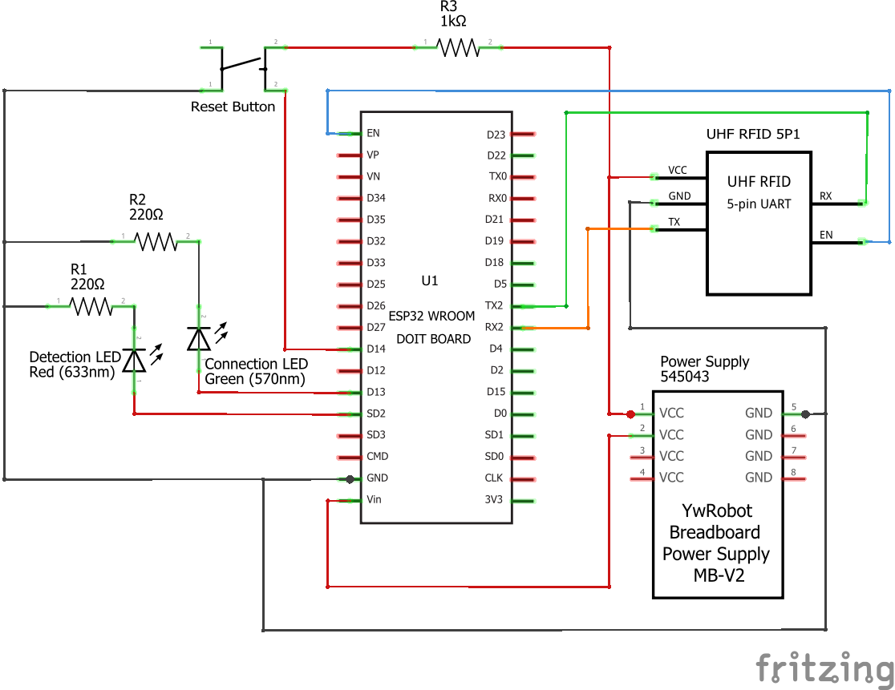

# Asset Tracker Sensor Node Firmware

I built this ESP32 firmware to support both physical node roles in the tracking system. A configured node can operate as a **Registration Desk Node**, which sends registration scans, or as a **Checkpoint Node**, which reports asset detections from an assigned hospital room.

The same codebase handles Wi-Fi setup, backend provisioning, UHF RFID communication, MQTT messaging, heartbeats, status LEDs, command acknowledgement, and recovery after temporary connection loss.



## Hardware

- ESP32 DevKit-compatible board
- EL-UHF-RMT01 UHF RFID reader
- UHF RFID antenna and tags
- Red and green status LEDs
- Reset/configuration button
- Stable power supply suitable for the ESP32, RFID reader, Wi-Fi activity, and LEDs

The current pin configuration uses UART2 for the reader and separate GPIO pins for reader enable, status LEDs, and the configuration-reset button. Check `include/node_config.h` and the wiring diagram before connecting hardware.

## Firmware behavior

- Starts a local Wi-Fi setup portal when valid configuration is unavailable
- Stores configuration in ESP32 preferences and serves setup assets from LittleFS
- Connects and reconnects to Wi-Fi and MQTT
- Requests or refreshes remote role and location configuration
- Configures and reads the UHF RFID module through UART
- Suppresses rapid duplicate tag observations
- Publishes registration scans or checkpoint detections according to node role
- Publishes periodic heartbeat and status messages
- Subscribes to node command topics after every MQTT connection
- Executes LED identification commands and returns acknowledgements
- Uses NTP-backed time handling for event timestamps
- Supports a held reset button for configuration recovery

## Source structure

```text
include/                     # Public classes, interfaces, enums, and configuration
src/
├── my_node_core_src/        # Pure validation, timing, text, and state logic
├── my_node_led_src/         # Status and identification LED behavior
├── my_node_manager_src/     # System coordination and runtime workflow
├── my_node_mqtt_src/        # MQTT connection, topics, payloads, and publishing
├── my_node_network_src/     # Wi-Fi, captive portal, storage, and remote config
└── my_node_rfid_src/        # RFID commands, frames, inventory, and power setup
data/                        # LittleFS captive-portal HTML, CSS, and JavaScript
test/                        # Native and ESP32 Unity tests
```

`NodeManager` coordinates the interfaces rather than directly owning every hardware implementation, which makes the pure behavior easier to test.

## Dependencies

- PlatformIO
- Arduino framework for ESP32
- PubSubClient
- ArduinoJson
- Unity test framework

## Build and upload

```bash
pio run
```

Upload the captive-portal filesystem before or alongside the firmware:

```bash
pio run --target buildfs
pio run --target uploadfs --upload-port <PORT>
pio run --target upload --upload-port <PORT>
pio device monitor --port <PORT> --baud 115200
```

## Initial setup

1. Power the node with the RFID reader connected correctly.
2. Connect to the node's temporary setup access point.
3. Open the setup page and enter Wi-Fi and backend information.
4. Let the node enroll with the backend.
5. Assign the node from the Registration App.
6. Restart or refresh the node configuration.
7. Confirm MQTT connection and heartbeat status.

A Checkpoint Node requires a room assignment. A Registration Desk Node is used for registration scans and normally does not require a checkpoint room.

## MQTT topics

The current topic design follows this pattern:

```text
<namespace>/nodes/<device-id>/rfid/asset-registration
<namespace>/nodes/<device-id>/rfid/detected
<namespace>/nodes/<device-id>/heartbeat
<namespace>/nodes/<device-id>/status
<namespace>/nodes/<device-id>/commands/blink
<namespace>/nodes/<device-id>/commands/ack
```

## Tests

Native tests run without a connected ESP32:

```bash
pio test -e native
```

Hardware tests run on the ESP32:

```bash
pio test -e esp32doit-devkit-v1 --upload-port <PORT> --test-port <PORT>
```

The current test tree contains 13 active suites and 56 registered Unity test cases covering timing, text helpers, state decisions, remote configuration, duplicate tags, MQTT topics, payloads, guards, and commands.

See [`UNIT_TEST_README.md`](./UNIT_TEST_README.md) for additional commands.

## Security and deployment notes

Before public or production deployment, I would move the setup access-point password, provisioning credential, and deployment URL out of `include/node_config.h`, rotate development values, and use a secure provisioning process. The firmware should also be validated with the final power supply, enclosure, antenna placement, hospital network, and MQTT security settings.
